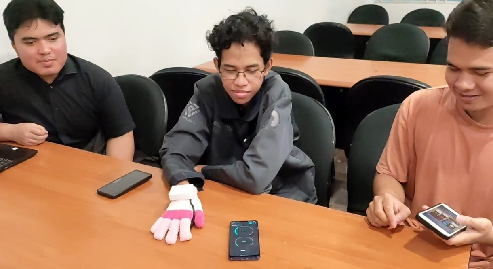

# 🧤 Wearable Device untuk Deteksi Stres Berbasis Sinyal Photoplethysmogram 

## Anggota Kelompok 
- 225150307111050      Muhammad Gulam Syarif 
- 225150307111052      Muhammad Arif Wijayanto 
- 225150307111058      Noel Oscar Ginting Suka
- 225150307111060      Nasywa Azizah Zharifah 
- 225150307111064      Rama Wira Putra Pratama
- 225150307111070      Kathleen Evelyn 

## Project Domain 

Project ini berfokus pada deteksi stres menggunakan sinyal photoplethysmogram yang diekstrak dari sensor MAX30102. Menggunakan mikrokontroler ESP32S3 dan algoritma Random Forest. Unit output yang digunakan adalah BLYNK serta buzzer. Buzzer akan berbunyi ketika klasifikasi menunjukkan stress, dan BLYNK menunjukkan keadaan pengguna serta nilai AVNN serta SDNN. 

### 📌 Problem Statements 
- Bagaimana cara mendeteksi tingkat stres seseorang menggunakan wearable device?
- Sensor apa yang dapat digunakan untuk mendeteksi stres secara akurat?
- Apa algoritma yang tepat untuk mengolah data sensor guna menentukan tingkat stres pengguna?

### 🎯 Goals 

- Merancang dan mengembangkan wearable device yang dapat mendeteksi tingkat stres secara real-time.
- Mengidentifikasi dan mengimplementasikan sensor yang tepat untuk mendeteksi stres.
- Mengembangkan algoritma stres untuk memproses data guna menentukan tingkat stres pengguna.

### 💻 Solution Statements 

- Mengintegrasikan sensor MAX30102 dalam sistem wearable untuk mendeteksi stres dengan menggunakan sinyal PPG
- Membuat model machine learning untuk klasifikasi data dari sensor dengan akurasi yang tinggi

## Prerequiresite
### Block Diagram

### System Architecture

### Component Preparation 
- **ESP32S3**          : Mikrokontroler untuk memproses data dan mengatur cara kerja sistem 
- **Sensor MAX30102**  : Dipasang di jari untuk mengukur sinyal Photoplethysmography (PPG), yang kemudian diolah untuk memperoleh NN Interval sebagai dasar perhitungan HRV (Heart Rate Variability)
- **Buzzer**           : Unit Output dari sistem yang akan berbunyi ketika pengguna terdeteksi stres 
- **Baterai 3.7V**     : Sumber energi listrik dari sistem
- **Switch**           : Sebagai saklar dari sistem 

### Schematic Fritzing 

Sensor MAX30102 terhubung ke ESP32 melalui komunikasi I2C dengan pin SDA dan SCL, serta diberi daya dari pin 3.3V dan GND ESP32. Buzzer aktif dihubungkan ke salah satu pin digital ESP32 dan GND untuk menghasilkan bunyi sebagai alarm. Saklar terpasang di antara jalur positif baterai dan pin VIN ESP32, berfungsi sebagai tombol ON/OFF untuk menyalakan atau mematikan sistem. Ketika saklar diaktifkan, ESP32 akan menyala dan membaca data dari sensor. 
## Demo and Evaluation 

 
[Link Video Demo](https://drive.google.com/file/d/1cjtyF9RPJBtku9YXjsw_4RQSVNXWDSVF/view?usp=drive_link)

## 🗣️ Conclusion 
Dilakukan pengembangan sistem deteksi stress dengan sinyal photoplethysmogram dalam bentuk sarung tangan. Menggunakan sensor MAX30102 yang diletakkan pada ujung jari telunjuk pengguna. Penggunaan sensor MAX30102 dianggap sesuai dengan kebutuhan sistem, yaitu sinyal input IR untuk menghasilkan AVNN (Average of Normal to Normal interval) dan SDNN (Standard Deviation of NOrmal to Normal interval), ukurannya yang kecil sesuai untuk device yang bersifat wearable. Sinyal IR yang diambil dari hasil sensor diproses oleh model yang telah dikembangkan untuk menghasilkan hasil klasifikasi kelas berupa stress atau pun tidak stress. Jika hasil menunjukkan stress, maka buzzer akan berbunyi untuk mengingatkan pengguna. Digunakan Random Forest sebagai algoritma untuk model pembelajaran mesin, dikarenakan memiliki akurasi yang tinggi yaitu 95.6%  untuk dataset yang digunakan. Model dikembangkan dengan algoritma Random Forest dan ESP32 diprogramkan untuk memproses data berdasarkan model yang ada.

[Link Dataset Physionet](https://docs.google.com/spreadsheets/u/1/d/1GqMrDjzcKDsmbGkJskeb6wNuQdSm7kRE/htmlview#gid=230969375)

